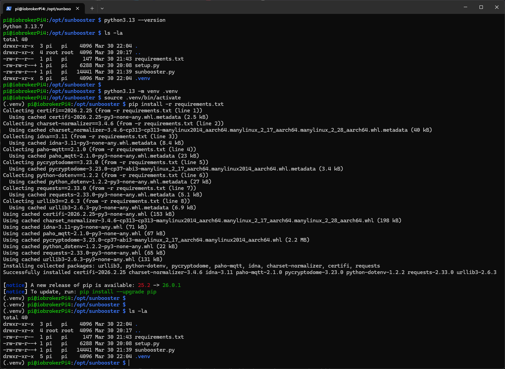

# Sunbooster CLI

## Voraussetzungen

- Python **3.13+** (getestet mit 3.13.7)
- Linux (für `source bin/activate`)

## Installation

1. Lege folgende Dateien in einen Ordner, z. B.:

```bash
sudo mkdir /opt/sunbooster
sudo chown pi:pi /opt/sunbooster
```

- `requirements.txt`
- `setup.py`
- `sunbooster.py`

Hinweis: Der Ordner und die Dateien müssen alle dem Standart-Nutzer gehören! (bei mir: pi)

2. Erstelle eine virtuelle Umgebung:

```bash
python3.13 -m venv .venv
```

3. Aktiviere die Umgebung:

```bash
source .venv/bin/activate
```

4. Installiere die Abhängigkeiten:

```bash
pip install -r requirements.txt
```



Hinweis: Die Installation der einzelnen Pakete (Schritt 4) kann bei jedem anders aussehen

## Einrichtung

Starte das Setup:

```bash
python setup.py
```

Du wirst interaktiv durch die Konfiguration geführt:

- Login mit **E-Mail & Passwort**
- Auswahl deines **Sunbooster-Geräts**

Am Ende wird automatisch eine `.env` Datei erstellt.

## Test

Überprüfe, ob alles funktioniert:

```bash
python sunbooster.py -h
```

Wenn eine Hilfe angezeigt wird: ✅ alles korrekt

Dann:

```bash
python sunbooster.py -r
```

Wenn Gerätedaten angezeigt werden: ✅ Verbindung erfolgreich

## Verwendung

### Hilfe anzeigen

```bash
python sunbooster.py -h
```

### Werte auslesen (JSON)

```bash
python sunbooster.py -r
```

### Ladegeschwindigkeit setzen

```bash
python sunbooster.py -c [off|normal|fast|slow]
```

### Einspeiseleistung setzen

```bash
python sunbooster.py -o [Watt]
```

Beispiel:

```bash
python sunbooster.py -c fast
python sunbooster.py -o 400
```

## Aktelle Verwendung im ioBroker

```js
// stdout enthält den Rückgabewert vom Konsolenbefehl. Hier wird also ein JSON-Objekt als String in stdout zurückgegeben.
// stderr würde mögliche Fehler als String enthalten.
exec("/opt/sunbooster/.venv/bin/python /opt/sunbooster/sunbooster.py -r", (error, stdout, stderr) => {
    if (stderr) {
        console.error(stderr);
    } else {
        console.log(stdout);
    }
})
```

## Hinweise

- Stelle sicher, dass die virtuelle Umgebung aktiv ist
- Die `.env` Datei muss im gleichen Verzeichnis liegen
- Internetverbindung erforderlich
